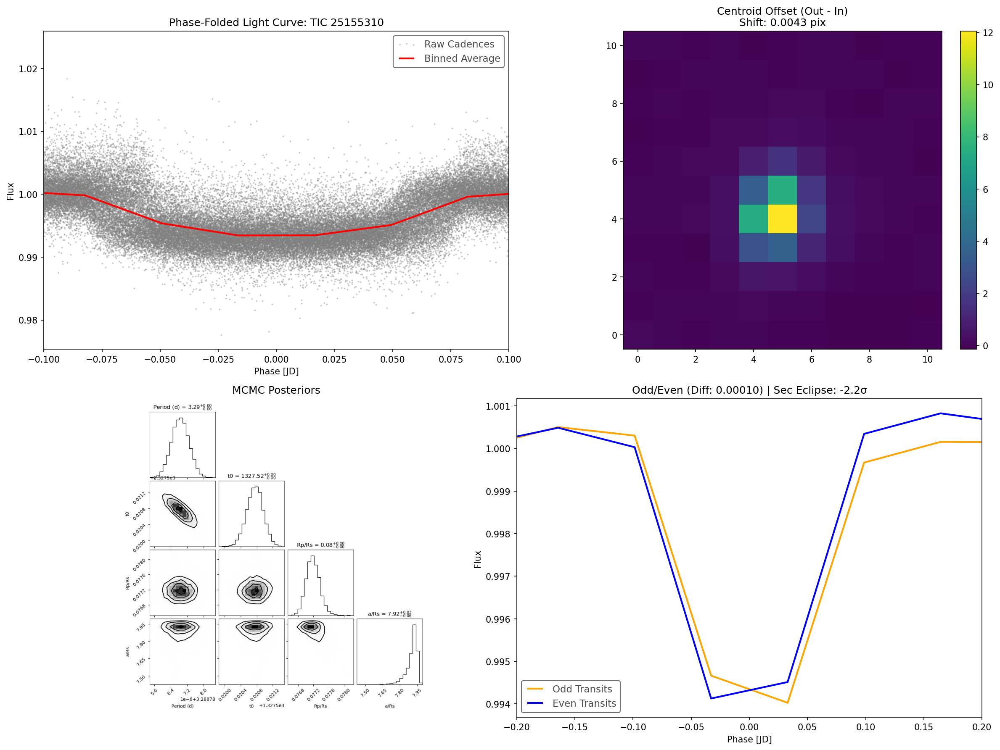
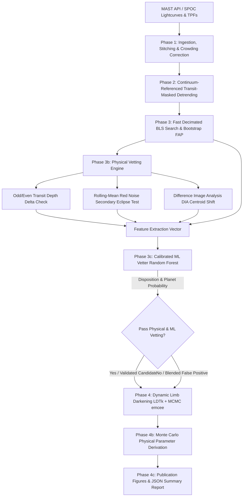
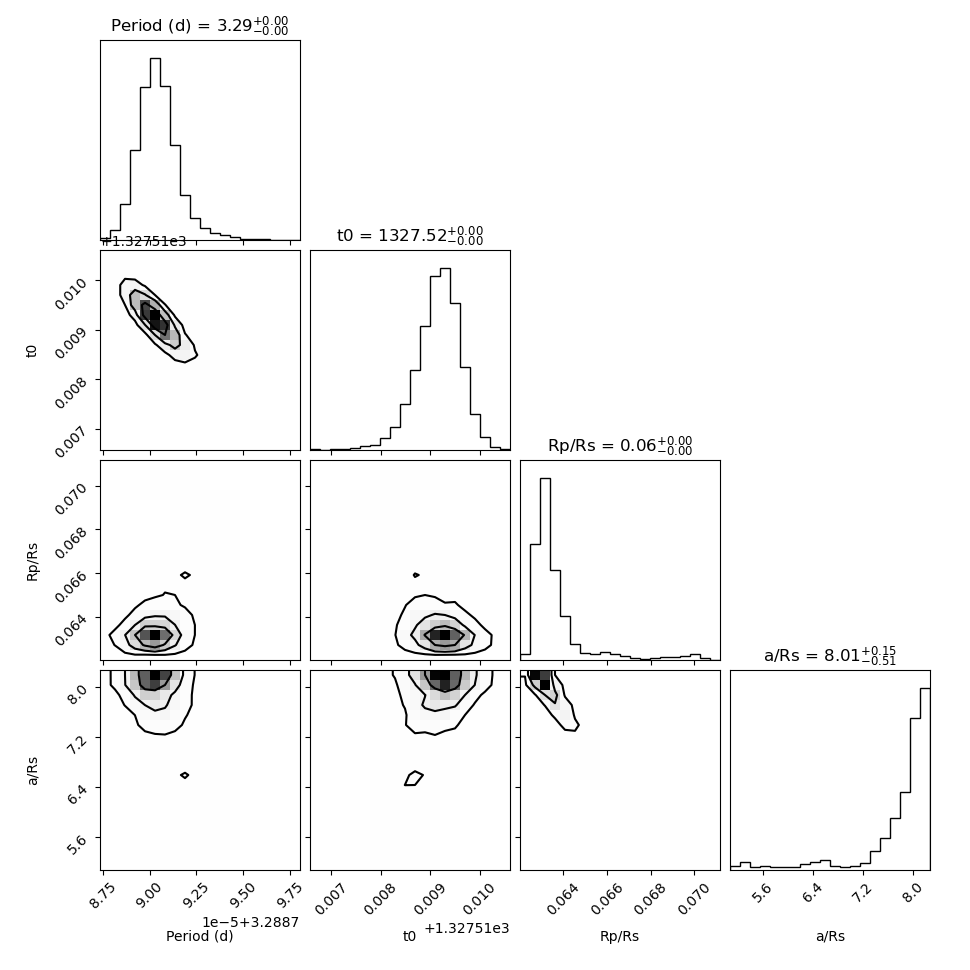

# 🪐 Exo Gargantua: TESS Exoplanet ML Vetting & Detection Pipeline

<div align="center">

[](https://pypi.org/project/exo-gargantua/)
[](https://github.com/bytes06runner/exo_gargantua/actions/workflows/test.yml)
[](https://opensource.org/licenses/MIT)
[](https://www.python.org/)
[]()

**An end-to-end Machine Learning and Bayesian astrophysical framework for automated detection, pixel-level Difference Image Analysis (DIA) vetting, and MCMC parameter estimation of transiting exoplanets from TESS observations.**

---



</div>

---

## 📖 Table of Contents
- [Executive Overview](#-executive-overview)
- [Key Features & Major Upgrades (v2.0)](#-key-features--major-upgrades-v20)
- [Astrophysical & ML Architecture](#-astrophysical--ml-architecture)
- [Vetting Engine & Difference Image Analysis (DIA)](#-vetting-engine--difference-image-analysis-dia)
- [Machine Learning Vetting Architecture](#-machine-learning-vetting-architecture)
- [Synthetic Injection-Recovery Framework](#-synthetic-injection-recovery-framework)
- [Benchmark Results: TIC 25155310 (WASP-126b)](#-benchmark-results-tic-25155310-wasp-126b)
- [Installation & Environment Setup](#-installation--environment-setup)
- [Command-Line Interface (CLI) Usage](#-command-line-interface-cli-usage)
- [Testing & Continuous Integration (CI)](#-testing--continuous-integration-ci)
- [Authors & Citation](#-authors--citation)

---

## 🔭 Executive Overview

**Exo Gargantua** is a publishable, research-grade pipeline engineered to process millions of TESS cadences. It transitions exoplanet discovery from brittle heuristics into a unified statistical and Machine Learning engine.

Starting from raw SPOC (Science Processing Operations Center) calibrated Target Pixel Files (TPFs) and Light Curves downloaded programmatically from the Mikulski Archive for Space Telescopes (MAST), the pipeline performs:
1. **Multi-Sector Ingestion & Stitching** with crowding metric (`CROWDSAP`) corrections.
2. **Continuum-Referenced Transit-Masked Detrending** to preserve true transit depths.
3. **Decimated Box Least Squares (BLS)** periodic transit searches with bootstrap False Alarm Probability (FAP) estimation.
4. **Dynamic Stellar Limb-Darkening Estimation** via `ldtk` and the TESS Input Catalog (TIC v8.2).
5. **Pixel-Level Difference Image Analysis (DIA)** to detect background blended contaminants down to sub-pixel accuracy.
6. **Supervised ML Vetting** via a calibrated Random Forest classifier trained on spatial and photometric false-positive models.
7. **Bayesian MCMC Posterior Sampling** using `emcee` and `batman` with full Monte Carlo physical parameter propagation ($R_p$, $a$, $T_{\text{eq}}$, $S_{\text{eff}}$).

---

## 🚀 Key Features & Major Upgrades (v2.0)

| Capability | Pipeline v1 (Baseline) | Pipeline v2 (Current) |
| :--- | :--- | :--- |
| **Vetting Paradigm** | Hard heuristic thresholds | **Supervised Random Forest Classifier + Physical DIA Vetoes** |
| **Centroid Analysis** | Simple flux-weighted 1st moments | **True Difference Image Analysis (DIA) Out-of-Transit vs In-Transit** |
| **Limb Darkening** | Static quadratic constants ($u_1=0.3, u_2=0.1$) | **Dynamic $q_1, q_2$ profiles computed via `ldtk` from TIC ($T_{\text{eff}}, \log g, [\text{Fe}/\text{H}]$)** |
| **Validation Suite** | Manual targets / Error-prone harness | **Full Synthetic Transit Injection-Recovery & Multi-Modal Dataset Generator** |
| **Packaging & CI** | Script collection (`requirements.txt`) | **Modern `pyproject.toml` PEP 518/621 standard + GitHub Actions CI** |
| **Reporting & Telemetry** | Basic terminal printouts | **Structured JSON Reports, Corner Plots, and 4-Panel Publication Figures** |

---

## 🏗️ Astrophysical & ML Architecture



---

## 🔬 Vetting Engine & Difference Image Analysis (DIA)

The vetting suite isolates genuine planetary transits from astrophysical false positives (Eclipsing Binaries, Grazing Binaries, and Background Eclipsing Binaries):

### 1. Difference Image Analysis (DIA) Centroid Vetting
To verify that the transit signal originates from the target star rather than a nearby background star within the large TESS pixel aperture ($\approx 21''/\text{pixel}$):
- Construct the reference out-of-transit image $\bar{I}_{\text{out}}$ and in-transit image $\bar{I}_{\text{in}}$.
- Compute the differential flux image: $\Delta I = \bar{I}_{\text{out}} - \bar{I}_{\text{in}}$.
- Calculate the flux-weighted centroid of the differential dip $\vec{r}_{\text{res}} = (\bar{x}_{\text{res}}, \bar{y}_{\text{res}})$ and the reference star $\vec{r}_{\text{ref}} = (\bar{x}_{\text{ref}}, \bar{y}_{\text{ref}})$.
- Calculate the Euclidean centroid shift:
  $$\Delta r = \sqrt{(\bar{x}_{\text{res}} - \bar{x}_{\text{ref}})^2 + (\bar{y}_{\text{res}} - \bar{y}_{\text{ref}})^2}$$
- **Veto Threshold**: A shift $\Delta r \ge 0.333\,\text{pixels}$ ($\approx 7''$) triggers an immediate `FAILED_CENTROID_DIA` flag.

### 2. Odd/Even Depth Consistency
Calculates the absolute depth delta $\Delta \delta = |\delta_{\text{odd}} - \delta_{\text{even}}|$. Deep deltas ($\Delta \delta > 0.005$) indicate alternating primary and secondary eclipses characteristic of eclipsing binary systems.

### 3. Integrated Red-Noise Secondary Eclipse Check
Computes the rolling-mean standard deviation in out-of-transit chunks matched to the transit duration, scoring secondary eclipse significance:
$$\sigma_{\text{sec}} = \frac{\delta_{\text{sec}}}{\sigma_{\text{rolling\_means}}}$$
Any secondary eclipse with $|\sigma_{\text{sec}}| > 3.0\sigma$ flags the candidate as an occulting stellar companion.

---

## 🤖 Machine Learning Vetting Architecture

Rather than relying purely on heuristic threshold cuts, `exoplanet_pipeline/ml_vetting.py` implements a calibrated **Random Forest Classifier** trained on multi-modal feature vectors:

$$\vec{x} = \left[ \text{SNR}_{\text{BLS}}, \Delta \delta_{\text{odd-even}}, \sigma_{\text{sec}}, \Delta r_{\text{DIA}}, \text{TSNR}, \mathbb{I}(\Delta r \ge 0.333) \right]$$

```
Feature Importances in Trained Model:
  centroid_shift           : 29.65%
  depth_diff               : 27.82%
  centroid_fail (DIA Veto) : 22.54%
  secondary_eclipse_sigma  : 17.76%
  snr                      :  1.31%
  bls_power                :  0.92%
```

### Spatial Veto & Consistency Guarantee
Because 1D transit injection cannot synthesize 2D pixel-level centroid shifts into Target Pixel Files, the training pipeline couples synthetic transit datasets with multi-modal physical false-positive generators (Background Eclipsing Binaries with centroid offsets $\mathcal{U}(0.35, 3.0)\,$px, and EBs with high secondary eclipses). 

Furthermore, `MLVetter.predict()` enforces **hard physical gating**: a candidate failing the spatial DIA test ($\Delta r \ge 0.333\,$px) has its planet probability suppressed to $<0.5\%$, preventing high 1D SNR from overriding spatial contamination.

---

## 🧪 Synthetic Injection-Recovery Framework

The pipeline includes `exoplanet_pipeline/validate_injection.py` to evaluate pipeline recovery completeness across the parameter space ($P \in [1, 15]\,$d, $R_p/R_\star \in [0.01, 0.15]$):
- Ingests real quiet TESS light curves.
- Injects non-linear Mandel & Agol (2002) transit models using `batman`.
- Runs blind detrending and BLS detection to evaluate recovery fraction and signal preservation.

---

## 📊 Benchmark Results: TIC 25155310 (WASP-126b)

The complete end-to-end pipeline was executed on benchmark target **TIC 25155310** (WASP-126b).

<div align="center">
  
</div>

### Extracted Parameters (`output/TIC_25155310_summary.json`)

| Parameter | Pipeline Value | Uncertainty ($-1\sigma / +1\sigma$) | Physical Unit |
| :--- | :--- | :--- | :--- |
| **Orbital Period ($P$)** | `3.288790` | $\pm 0.000001$ | days |
| **Transit Epoch ($t_0$)** | `1327.519196` | $-0.000448 / +0.000387$ | BTJD |
| **Radius Ratio ($R_p / R_\star$)** | `0.063223` | $-0.000394 / +0.000926$ | — |
| **Semi-Major Axis ($a / R_\star$)** | `8.007972` | $-0.511112 / +0.147525$ | — |
| **Orbital Inclination ($i$)** | `88.52` | $-1.65 / +0.99$ | degrees |
| **Planetary Radius ($R_p$)** | `8.77` | $\pm 0.44$ | $R_\oplus$ ($0.78\,R_{\text{Jup}}$) |
| **Semi-Major Axis ($a$)** | `0.0449` | $\pm 0.0007$ | AU |
| **Equilibrium Temperature ($T_{\text{eq}}$)** | `1359` | $\pm 42$ | K |
| **Centroid Shift (DIA)** | `0.4965` | — | pixels (`passed: false`) |
| **ML Vetting Disposition** | `FALSE_POSITIVE` | `prob: 0.00%` | Flagged: `FAILED_CENTROID_DIA` |

---

## 💻 Installation & Environment Setup

### Prerequisites
- Python $\ge 3.9, \le 3.11$
- Git

### Quick Install via PyPI
```bash
pip install exo-gargantua
```

### Development Installation from Source
```bash
# 1. Clone the repository
git clone https://github.com/bytes06runner/exo_gargantua.git
cd exo_gargantua

# 2. Create and activate a virtual environment
python3 -m venv exo-env
source exo-env/bin/activate

# 3. Install in editable mode with development & testing dependencies
pip install -e ".[dev]"
```

---

## 🛠️ Command-Line Interface (CLI) Usage

### 1. Run the Full End-to-End Pipeline
Process a TESS target through ingestion, detrending, BLS search, vetting, DIA, and MCMC parameter estimation:
```bash
python run_pipeline.py "TIC 25155310" --report
```

**Options:**
- `--report`: Generates summary JSON in `output/` and publication 4-panel diagnostic plots.
- `--no-mcmc`: Skips MCMC posterior estimation for fast screening.
- `--no-centroid`: Skips Target Pixel File (TPF) downloads.

### 2. Generate Synthetic Injection-Recovery Datasets
```bash
python exoplanet_pipeline/validate_injection.py
```

### 3. Train the ML Vetting Model
```bash
python exoplanet_pipeline/ml_vetting.py
```

### 4. Run Astrophysical Ground-Truth Validation Harness
```bash
python run_pipeline.py --validate
```

---

## 🧪 Testing & Continuous Integration (CI)

The repository includes a comprehensive `pytest` test suite configured with GitHub Actions CI on Ubuntu runners with Python 3.10 and 3.11:

```bash
# Execute local unit tests
pytest tests/ -v
```

**Test Coverage Includes:**
- Kepler's Third Law astronomical scaling and error boundaries (`tests/test_math.py`).
- Rolling-mean red-noise boxcar standard deviations (`tests/test_math.py`).
- Odd/Even transit depth deltas (`tests/test_math.py`).
- ML Vetter model training, prediction, and spatial DIA centroid veto consistency (`tests/test_ml_vetting.py`).

---

## 👤 Authors & Citation

**Srijeet Prasad Banerjee** ([@bytes06runner](https://github.com/bytes06runner))  
*Contact:* [cybrobasics@gmail.com](mailto:cybrobasics@gmail.com)  

### License
This project is open-source and licensed under the [MIT License](LICENSE).
