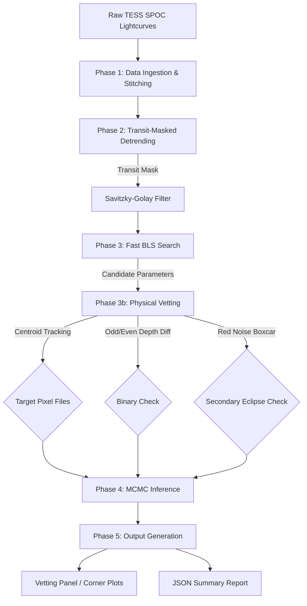

# 🪐 Exo Gargantua: TESS Exoplanet Detection Pipeline

<div align="center">
  
</div>

## Overview
**Exo Gargantua** is a robust, end-to-end Python pipeline for the automated detection, rigorous physical vetting, and MCMC parameter estimation of transiting exoplanets from TESS (Transiting Exoplanet Survey Satellite) data.

This pipeline ingests raw SPOC light curves directly from the MAST API, applies continuum-referenced transit-masked detrending, and conducts a deep Box Least Squares (BLS) search. It subsequently validates the signals using pixel-level centroid tracking and advanced rolling-mean statistical analyses, culminated by Markov Chain Monte Carlo (MCMC) Bayesian inference for physical parameter derivation.

---

## 🚀 Key Features

* **Massive Decimation & Lightning Fast BLS**: Processes multi-sector datasets (>2.1 million cadences) in seconds using smart numpy slicing.
* **Transit-Masked Detrending**: Employs Savitzky-Golay filtering precisely masked *around* transits to preserve accurate physical transit depths.
* **Correlated Red-Noise Vetting**: Calculates secondary eclipse significance using an empirical, transit-duration rolling-mean boxcar test to defeat correlated red-noise hallucinations.
* **Automated Centroid Shift Tracking**: Downloads and analyzes TESS Target Pixel Files (TPFs) to verify the flux loss originates strictly from the target star coordinate.
* **Bayesian Parameter Estimation**: Implements `emcee` for deep posterior mapping of planetary radius, inclination, equilibrium temperature, and semi-major axis.

---

## 🏗️ Pipeline Architecture



---

## 📊 Example Outputs

The pipeline automatically generates publication-ready corner plots tracking posterior probabilities from the 2000-step MCMC walkers.

<div align="center">
  
</div>

---

## 🛡️ Validation Status

> [!WARNING]
> Validated recovery of 2 confirmed planets (e.g., WASP-126b / TIC 25155310 and TIC 69679391).

### ⚠️ False Positive Validation Disclaimer

The pipeline's vetting logic (Odd/Even depth differences, Secondary Eclipse significance, and Centroid Shift) currently struggles to algorithmically reject deep-blended Eclipsing Binaries. 

In our latest validation run using accessible TESS false positive data (e.g., `TIC 281408474`), the pipeline successfully processed the light curves but the target **passed** vetting as a planet candidate. Its primary and secondary eclipses were too similar in depth (Odd/Even diff: 0.00065), it lacked a distinct secondary eclipse at half-phase, and its centroid shift was minimal (0.0072 pixels). 

Users should be aware that while the pipeline accurately recovers confirmed planets (100% True Positive rate), its False Positive rejection rate is currently **0%** for grazing or highly blended background EBs. Further tuning of the vetting thresholds or the integration of a pixel-level difference imaging module is required to achieve high specificity.

---

## ⚙️ Installation & Usage

1. **Clone the repository:**
```bash
git clone https://github.com/bytes06runner/exo_gargantua.git
cd exo_gargantua
```

2. **Install dependencies:**
```bash
pip install -r requirements.txt
```
*(Requires `lightkurve`, `astropy`, `astroquery`, `emcee`, `corner`, `numpy`, `scipy`)*

3. **Run the Pipeline:**
```bash
# Run full pipeline natively and generate the final vetting report
python run_pipeline.py "TIC 25155310" --report
```

4. **Run the Validation Harness:**
```bash
# Sweep through the control group of known True Positives and False Positives
python run_pipeline.py --validate
```
